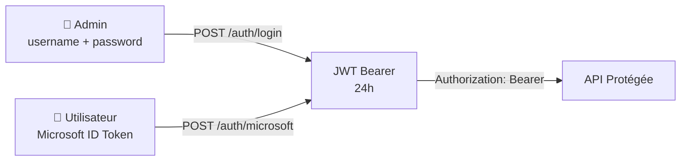

## Vue d'ensemble

L'API CNP propose deux modes d'authentification, les deux retournent un **JWT Bearer** (HMAC-SHA256) à inclure dans les requêtes suivantes.



---

## POST /auth/login

Authentification admin classique.

**Endpoint public** — aucun token requis.

### Corps de la requête

```json
{
  "username": "admin",
  "password": "votre-mot-de-passe"
}
```

### Réponse `200 OK`

```json
{ "token": "eyJhbGciOiJIUzI1NiIsInR5cCI6IkpXVCJ9..." }
```

| Status | Cause |
| --- | --- |
| `400` | JSON malformé |
| `401` | Identifiants invalides |

```bash
curl -X POST https://api.cnp.example.com/auth/login \
  -H "Content-Type: application/json" \
  -d '{"username": "admin", "password": "secret"}'
```

---

## POST /auth/microsoft

Authentification via **Microsoft Entra ID (Azure AD)**. Le frontend obtient un `id_token` depuis MSAL et le soumet au backend pour validation.

**Endpoint public** — aucun token requis.

### Corps de la requête

```json
{
  "id_token": "eyJ0eXAiOiJKV1QiLCJhbGciOiJSUzI1NiIsIng1dCI6..."
}
```

### Réponse `200 OK`

```json
{
  "token": "eyJhbGci...",
  "username": "john.doe@epita.fr",
  "email": "john.doe@epita.fr",
  "name": "John Doe"
}
```

Le backend valide :

- Signature RSA via JWKS (`login.microsoftonline.com`)
- Audience (`MICROSOFT_CLIENT_ID`)
- Issuer (`MICROSOFT_TENANT_ID`)
- Domaine email (`MICROSOFT_ALLOWED_DOMAIN`)

| Status | Cause |
| --- | --- |
| `400` | `id_token` manquant ou JSON invalide |
| `401` | Token Microsoft refusé (expiré, mauvais tenant, domaine non autorisé) |

---

## GET /api/me

Retourne les infos de l'utilisateur connecté. **Protégé** — token JWT requis.

### Réponse `200 OK`

```json
{ "username": "admin" }
```

---

## GET /health

Endpoint de santé — vérifie la connexion PostgreSQL.

```json
{ "status": "ok" }
```

---

## Structure du JWT

```json
{
  "username": "admin",
  "exp": 1717000000,
  "iat": 1716913600
}
```

Signé avec **HS256**, expire après **24h**.