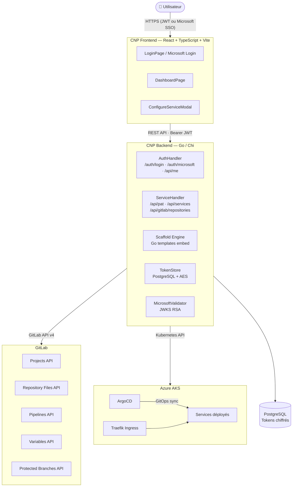
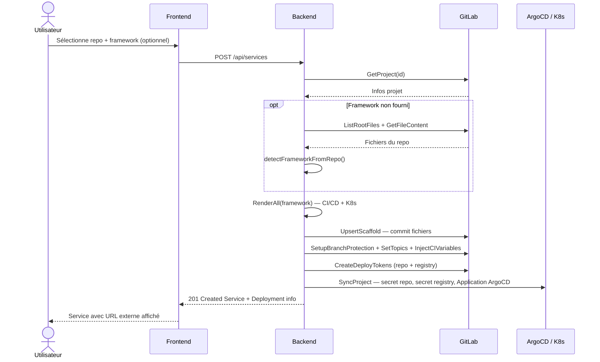

## Vue d'ensemble



## Composants

### Frontend (`cnp-frontend`)

| Fichier | Rôle |
| --- | --- |
| `pages/LoginPage.tsx` | Connexion admin \+ Microsoft SSO |
| `pages/DashboardPage.tsx` | Liste des services \+ IP externe |
| `components/ConfigureServiceModal.tsx` | Sélection repo \+ framework (auto ou manuel) |
| `components/ServiceCard.tsx` | Carte service avec lien de déploiement |
| `components/PATSetupBanner.tsx` | Bannière de configuration PAT |
| `lib/api.ts` | Client HTTP vers le backend |
| `context/AuthContext.tsx` | Context React pour la session |

### Backend (`cnp-backend`)

| Package | Rôle |
| --- | --- |
| `internal/handler` | Handlers HTTP (auth, services) |
| `internal/middleware` | CORS, JWT validation |
| `internal/auth` | JWT HS256 \+ Microsoft JWKS validator |
| `internal/scaffold` | Génération et push des fichiers CI/CD \+ K8s |
| `internal/gitlab` | Client GitLab (variables, pipeline, deploy tokens, fichiers) |
| `internal/argocd` | Syncer ArgoCD (Application, secrets repo \+ registry) |
| `internal/model` | Types partagés (Service, Framework, Deployment) |
| `internal/store` | Interface `TokenStore` avec impl PostgreSQL et mémoire |
| `internal/security` | Chiffrement AES des tokens (`TokenCipher`) |
| `internal/database` | Connexion PostgreSQL |
| `internal/config` | Chargement depuis l'environnement |

### Scaffold Engine

Templates Go (`text/template`) embarqués via `//go:embed` :

```text
scaffold/templates/
├── common/k8s/
│   ├── deployment.yaml.tmpl
│   ├── service.yaml.tmpl
│   └── ingress.yaml.tmpl
├── go/
│   ├── .gitlab-ci.yml.tmpl
│   ├── Dockerfile.tmpl
│   ├── go.mod.tmpl
│   └── README.md.tmpl
├── nextjs/
│   ├── .gitlab-ci.yml.tmpl
│   └── Dockerfile.tmpl ...
├── nestjs/
│   ├── .gitlab-ci.yml.tmpl
│   ├── Dockerfile.tmpl
│   └── README.md.tmpl
├── springboot/
│   ├── .gitlab-ci.yml.tmpl
│   └── Dockerfile.tmpl
└── django/
    ├── .gitlab-ci.yml.tmpl
    ├── Dockerfile.tmpl
    └── README.md.tmpl
```

### Infrastructure (Terraform)

| Ressource | Description |
| --- | --- |
| AKS | Cluster Kubernetes `Standard_B2s_v2`, `switzerlandnorth` |
| ArgoCD | Déployé via Helm sur le cluster AKS |
| Traefik | Ingress controller, exposé via LoadBalancer Azure |

## Flux de configuration d'un service

