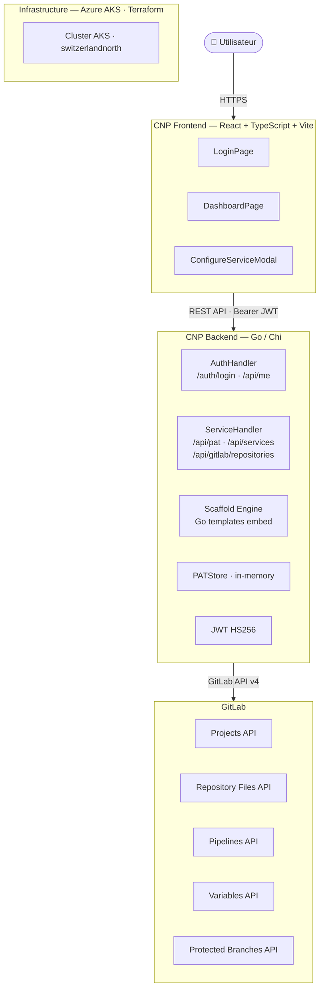
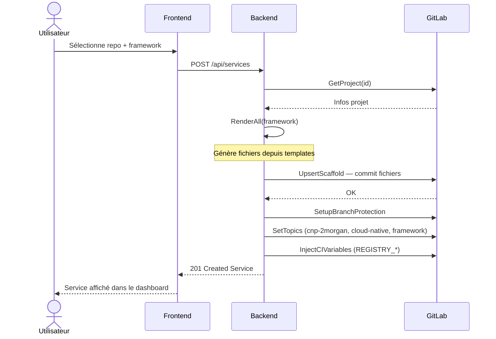

## Vue d'ensemble



## Composants

### Frontend (`cnp-frontend`)

Application React SPA construite avec Vite.

| Fichier | Rôle |
| --- | --- |
| `pages/LoginPage.tsx` | Formulaire de connexion |
| `pages/DashboardPage.tsx` | Liste des services \+ actions |
| `components/ConfigureServiceModal.tsx` | Modale de création de service |
| `components/ServiceCard.tsx` | Carte d'un service |
| `components/PATSetupBanner.tsx` | Bannière de configuration PAT |
| `lib/api.ts` | Client HTTP vers le backend |
| `context/AuthContext.tsx` | Context React pour la session |

### Backend (`cnp-backend`)

| Package | Rôle |
| --- | --- |
| `internal/handler` | Handlers HTTP (auth, services) |
| `internal/middleware` | CORS, JWT validation |
| `internal/scaffold` | Génération et push des fichiers CI/CD |
| `internal/gitlab` | Client GitLab (variables, pipeline, protection) |
| `internal/model` | Types partagés (Service, Framework) |
| `internal/auth` | Génération/validation JWT (HS256) |
| `internal/store` | Store in-memory des PATs GitLab |
| `internal/config` | Chargement depuis l'environnement |

### Scaffold Engine

Les templates Go (`text/template`) sont embarqués dans le binaire via `//go:embed` :

```text
scaffold/templates/
├── go/
│   ├── .gitlab-ci.yml.tmpl
│   ├── Dockerfile.tmpl
│   ├── .gitignore.tmpl
│   ├── go.mod.tmpl
│   └── README.md.tmpl
├── nextjs/
│   ├── .gitlab-ci.yml.tmpl
│   ├── Dockerfile.tmpl
│   └── app/page.tsx.tmpl ...
└── springboot/
    ├── .gitlab-ci.yml.tmpl
    └── Dockerfile.tmpl
```

Variables disponibles dans les templates :

| Variable | Description |
| --- | --- |
| `{{.ServiceName}}` | Nom du projet GitLab |
| `{{.ModulePath}}` | Chemin du module Go |
| `{{.GoVersion}}` | Version Go (ex: `1.22`) |
| `{{.NodeVersion}}` | Version Node.js (ex: `20`) |

### Infrastructure

| Paramètre | Valeur |
| --- | --- |
| Région | `switzerlandnorth` |
| Resource Group | `2MorganCNP` |
| VM | `Standard_B2s_v2` |
| Réseau | kubenet, CIDR `10.0.0.0/16` |

## Flux de configuration d'un service

