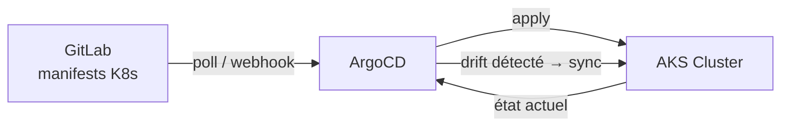

# ArgoCD & Déploiement GitOps

Après le scaffold, CNP ne s'arrête pas à la création des fichiers dans GitLab. Il **déclenche automatiquement le déploiement** de votre service sur le cluster AKS via **ArgoCD** — le moteur GitOps de référence pour Kubernetes.

## Qu'est-ce qu'ArgoCD ?

ArgoCD est un outil GitOps qui surveille en continu un dépôt Git et maintient l'état du cluster Kubernetes synchronisé avec les manifests présents dans ce dépôt.



## Ce que CNP fait automatiquement

Lors d'un appel à `POST /api/services`, le backend CNP exécute les étapes suivantes après le scaffold GitLab :

<Steps>
  <Step title="Création du secret dépôt">
    CNP crée un secret Kubernetes `repo-<service>` dans le namespace ArgoCD avec les **deploy tokens** GitLab (type `deploy_repository`), permettant à ArgoCD de cloner le dépôt privé.
  </Step>
  <Step title="Création du secret registry">
    Un second secret `registry-<service>` est créé avec les credentials de la **registry GitLab** (type `deploy_registry`) pour que Kubernetes puisse puller l'image Docker.
  </Step>
  <Step title="Création de l'Application ArgoCD">
    CNP crée une ressource `Application` ArgoCD pointant vers le dossier `k8s/` du dépôt. ArgoCD commence immédiatement à surveiller et synchroniser.
  </Step>
  <Step title="Récupération de l'IP Ingress">
    Après la création, CNP interroge l'Ingress Kubernetes pour récupérer l'**IP publique** assignée par Traefik et la retourner dans la réponse API.
  </Step>
</Steps>

## Manifests K8s générés

Chaque service scaffoldé reçoit trois manifests dans le dossier `k8s/` :

```text
k8s/
├── deployment.yaml   # Déploiement avec imagePullSecrets
├── service.yaml      # Service ClusterIP
└── ingress.yaml      # Ingress Traefik avec TLS
```

### Exemple — deployment.yaml

```yaml
apiVersion: apps/v1
kind: Deployment
metadata:
  name: mon-service
  namespace: production
spec:
  replicas: 2
  selector:
    matchLabels:
      app: mon-service
  template:
    spec:
      imagePullSecrets:
        - name: gitlab-registry-12345
      containers:
        - name: mon-service
          image: registry.cri.epita.fr/group/mon-service:latest
          imagePullPolicy: Always
          ports:
            - containerPort: 3000
```

## Types de tokens utilisés

CNP génère et stocke plusieurs types de tokens dans PostgreSQL :

| Type | Usage |
| --- | --- |
| `pat` | Personal Access Token GitLab de l'utilisateur |
| `deploy_repository` | Accès clone (lecture) pour ArgoCD |
| `deploy_registry` | Pull d'images Docker pour Kubernetes |

Tous les tokens sont **chiffrés en AES-256** avant persistance en base de données.

## Configuration requise

Pour activer l'intégration ArgoCD, configurez les variables d'environnement suivantes :

```bash
# Namespace ArgoCD sur le cluster
ARGOCD_NAMESPACE=argocd

# Namespace cible pour les déploiements
ARGOCD_TARGET_NAMESPACE=default

# Accès au cluster (chemin vers kubeconfig ou in-cluster)
KUBECONFIG=/path/to/kubeconfig
```

<Note>
  Si CNP tourne **dans le cluster AKS** lui-même (via un Pod), `KUBECONFIG` peut être omis — le client Kubernetes utilisera automatiquement le service account du Pod.
</Note>

## Redéploiement manuel

Si vous avez besoin de forcer un nouveau déploiement sans modifier le code, utilisez l'endpoint dédié :

```bash
curl -X POST https://cnp-api.example.com/api/services/{id}/redeploy \
  -H "Authorization: Bearer <JWT>"
```

Cela force ArgoCD à re-synchroniser l'Application et Kubernetes à re-puller l'image `:latest`.

## Surveillance et état

Une fois déployé, vous pouvez suivre l'état de votre service via :

- **ArgoCD UI** : visualisation du graphe de ressources K8s
- **`GET /api/services`** : retourne le champ `deployment` avec l'IP Ingress et le statut
- **`kubectl get ingress -n <namespace>`** : état direct depuis le cluster