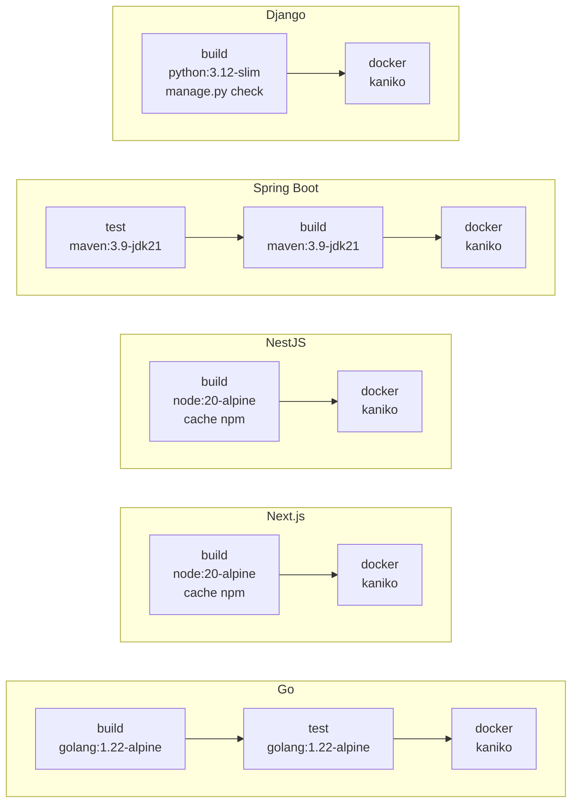
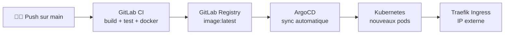
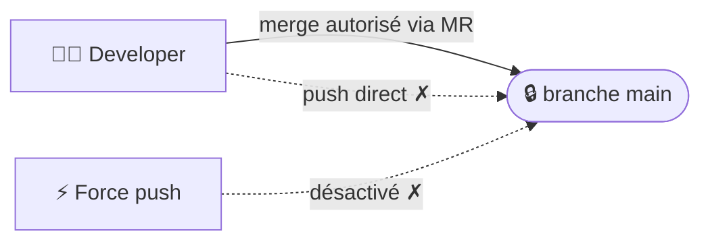

## Stages par framework



## Build Docker (Kaniko)

```yaml
docker-build:
  stage: docker
  image:
    name: gcr.io/kaniko-project/executor:debug
    entrypoint: [""]
  script:
    - /kaniko/executor
      --destination "${CI_REGISTRY_IMAGE}:${CI_COMMIT_SHORT_SHA}"
      --destination "${CI_REGISTRY_IMAGE}:latest"
  only:
    - main
```

<Warning>
  Le stage Docker ne s'exécute que sur `main`. Les branches de feature déclenchent uniquement build/test.
</Warning>

## Flux CI/CD → ArgoCD



## Variables CI disponibles

| Variable | Source | Description |
| --- | --- | --- |
| `CI_REGISTRY` | GitLab (auto) | URL du registry |
| `CI_REGISTRY_USER` | GitLab (auto) | Utilisateur registry |
| `CI_REGISTRY_PASSWORD` | GitLab (auto) | Mot de passe registry |
| `CI_REGISTRY_IMAGE` | GitLab (auto) | Chemin complet de l'image |
| `CI_COMMIT_SHORT_SHA` | GitLab (auto) | SHA court du commit |
| `REGISTRY_TOKEN` | CNP (injecté) | Token personnalisé |
| `REGISTRY_URL` | CNP (injecté) | URL registry personnalisé |
| `REGISTRY_USERNAME` | CNP (injecté) | Utilisateur registry personnalisé |

## Protection de branche



## Déclenchement de pipeline

Lors d'un **redéploiement**, CNP déclenche manuellement un pipeline et re-synchronise ArgoCD.

<Info>
  L'échec du déclenchement de pipeline est loggué en `WARN` mais n'échoue pas la requête. Le scaffold et la sync ArgoCD sont quand même effectués.
</Info>