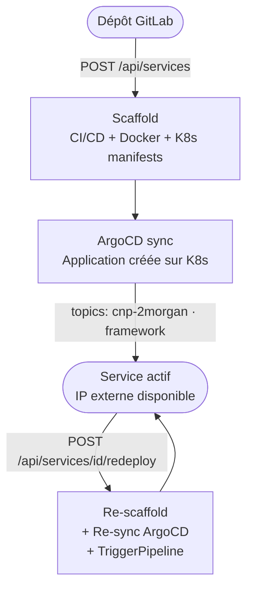

## Définition

Un **service** dans CNP correspond à un projet GitLab scaffoldé, déployé automatiquement sur Kubernetes via ArgoCD. Il est identifié par le topic GitLab `cnp-2morgan`.

## Modèle de données

```typescript
interface Service {
  name: string          // Nom du projet GitLab
  description: string   // Description du projet
  framework: Framework  // 'go' | 'nextjs' | 'nestjs' | 'springboot' | 'django'
  repo_url: string      // URL web du projet
  clone_url: string     // URL de clone HTTP
  gitlab_id: number     // ID numérique GitLab
  created_at: string    // Date de création ISO 8601
  deployment?: {        // Infos de déploiement (si disponible)
    external_ip: string // IP externe du LoadBalancer
    url: string         // URL d'accès http://<ip>/<path>
  }
}
```

## Cycle de vie



## Détection du framework

CNP détecte automatiquement le framework si non fourni, en analysant les fichiers du dépôt :

| Fichier / Indicateur | Framework détecté |
| --- | --- |
| `go.mod` ou `go.work` | Go |
| `next.config.js/ts/mjs` | Next.js |
| `nest-cli.json` | NestJS |
| `manage.py` | Django |
| `package.json` → `"next"` | Next.js |
| `package.json` → `"@nestjs/core"` | NestJS |
| `pom.xml` → `spring-boot-starter` | Spring Boot |
| `build.gradle` → `org.springframework.boot` | Spring Boot |
| `requirements.txt` → `django` | Django |
| `pyproject.toml` → `django` | Django |

## Topics GitLab

| Topic | Rôle |
| --- | --- |
| `cnp-2morgan` | Marqueur principal |
| `cloud-native` | Classification générale |
| `go` / `nextjs` / `nestjs` / `springboot` / `django` | Framework utilisé |

<Warning>
  Ne retirez pas le topic `cnp-2morgan` de votre projet GitLab, sinon il disparaîtra du dashboard CNP.
</Warning>

## Stockage des tokens (PostgreSQL)

Les tokens sont stockés dans PostgreSQL, **chiffrés avec AES** via `TokenCipher`.

```go
type TokenRecord struct {
  UserID        string
  GitLabHost    string
  TokenType     string     // "pat" | "deploy_repository" | "deploy_registry"
  ProjectID     int64      // 0 pour les PAT globaux
  TokenUsername string
  Token         string     // chiffré en base
  ExpiresAt     *time.Time
}
```

Trois types de tokens sont gérés par service :

| Type | Usage |
| --- | --- |
| `pat` | Token personnel GitLab de l'utilisateur |
| `deploy_repository` | Deploy token pour ArgoCD (pull du repo) |
| `deploy_registry` | Deploy token pour Kubernetes (pull de l'image) |