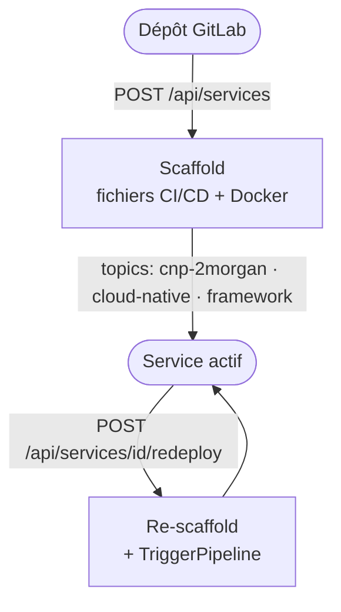

## Définition

Un **service** dans CNP correspond à un projet GitLab qui a été configuré via la plateforme. Il est identifié par le topic GitLab `cnp-2morgan` et se caractérise par un framework de déploiement.

## Modèle de données

```typescript
interface Service {
  name: string        // Nom du projet GitLab
  description: string // Description du projet
  framework: Framework // 'go' | 'nextjs' | 'springboot'
  repo_url: string    // URL web du projet
  clone_url: string   // URL de clone HTTP
  gitlab_id: number   // ID numérique GitLab
  created_at: string  // Date de création ISO 8601
}
```

## Cycle de vie



## Détection des services existants

CNP liste les services en interrogeant l'API GitLab avec les filtres :

- `topic = cnp-2morgan`
- `membership = true` (seuls les projets dont l'utilisateur est membre)

## Topics GitLab

| Topic | Rôle |
| --- | --- |
| `cnp-2morgan` | Marqueur principal — identifie les services CNP |
| `cloud-native` | Classification générale |
| `go` / `nextjs` / `springboot` | Framework utilisé |

<Warning>
  Ne retirez pas le topic `cnp-2morgan` de votre projet GitLab, sinon il disparaîtra du dashboard CNP.
</Warning>

## Store de PATs

Les Personal Access Tokens GitLab sont stockés **en mémoire** (in-process). Un redémarrage du backend efface tous les PATs — les utilisateurs doivent les reconfigurer.

```go
type PATStore struct {
  mu    sync.RWMutex
  store map[string]string // username → PAT
}
```