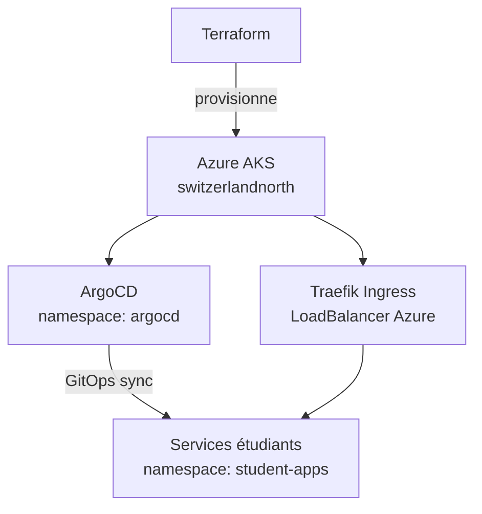

## Vue d'ensemble



## Ressources Terraform

| Ressource | Description |
| --- | --- |
| `azurerm_kubernetes_cluster` | Cluster AKS `Standard_B2s_v2`, `switzerlandnorth` |
| `argocd` (Helm) | ArgoCD déployé sur le cluster |
| `traefik` (Helm) | Ingress controller Traefik, exposé en LoadBalancer |

---

## Prérequis

```bash
az login
az account set --subscription <subscription-id>
cd terraform
terraform init
```

---

## Déployer

```bash
terraform plan -out=tfplan
terraform apply tfplan
```

Le `kubeconfig.yaml` est généré automatiquement dans `terraform/` avec les permissions `0600`.

---

## Variables Terraform

| Variable | Défaut | Description |
| --- | --- | --- |
| `project_name` | `cnp` | Préfixe du cluster |
| `environment` | `dev` | Environnement |
| `resource_group_name` | `2MorganCNP` | Resource group Azure |
| `location` | `switzerlandnorth` | Région Azure |
| `node_count` | `1` | Nombre de nodes (1-2 max) |
| `vm_size` | `Standard_B2s_v2` | Taille des VMs |

```bash
terraform apply -var="node_count=2" -var="environment=prod"
```

---

## Utiliser le cluster

```bash
export KUBECONFIG=./terraform/kubeconfig.yaml

# Vérifier les nodes
kubectl get nodes

# Vérifier ArgoCD
kubectl get pods -n argocd

# Vérifier Traefik
kubectl get svc -n traefik
```

---

## ArgoCD

ArgoCD surveille le dossier `k8s/` de chaque service et applique automatiquement les changements.

```bash
# Accéder à l'UI ArgoCD
kubectl port-forward svc/argocd-server -n argocd 8080:443

# Récupérer le mot de passe admin initial
kubectl -n argocd get secret argocd-initial-admin-secret \
  -o jsonpath="{.data.password}" | base64 -d
```

---

## Traefik

Traefik est exposé via un LoadBalancer Azure et reçoit une IP externe automatiquement.

```bash
# Récupérer l'IP externe de Traefik
kubectl get svc -n traefik traefik \
  -o jsonpath="{.status.loadBalancer.ingress[0].ip}"
```

Cette IP est celle retournée dans `service.deployment.external_ip` par l'API CNP.

---

<Warning>
  Ce cluster est configuré pour un compte étudiant Azure :

  - Maximum **2 nodes**
  - VM `Standard_B2s_v2` (2 vCPU, 8 Go RAM)
  - Certaines régions peuvent ne pas être disponibles
</Warning>