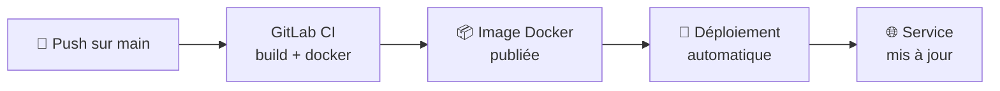

# Mon service déployé

## Le tableau de bord

Après configuration, votre service est visible sur le dashboard CNP :

| Information | Description |
| --- | --- |
| **Nom** | Le nom de votre projet GitLab |
| **Framework** | Le framework détecté ou sélectionné |
| **URL** | L'adresse pour accéder à votre service |
| **Lien GitLab** | Accès direct à votre dépôt |

---

## Les fichiers créés dans votre dépôt

CNP a ajouté les fichiers suivants sur votre branche principale :

### `.gitlab-ci.yml` — Pipeline CI/CD

Ce fichier déclenche automatiquement la construction de votre application à chaque push sur `main`. Il contient les étapes pour compiler, tester et publier l'image Docker.

### `Dockerfile`

Définit comment votre application est empaquetée dans une image Docker. Adapté à votre framework.

### Dossier `k8s/` — Manifests Kubernetes

Trois fichiers pour déployer votre application :

- `k8s/deployment.yaml` — déploiement de votre application
- `k8s/service.yaml` — exposition interne
- `k8s/ingress.yaml` — accès externe

<Info>
  Vous pouvez modifier ces fichiers pour personnaliser votre déploiement (nombre de réplicas, variables d'environnement, ressources allouées...).
</Info>

---

## Le cycle de mise à jour

Après chaque push sur `main`, le pipeline démarre automatiquement.

---

## Accéder à votre service

L'URL s'affiche sur le dashboard CNP, au format `http://x.x.x.x/`.

Si l'URL n'est pas encore disponible, attendez que le premier pipeline ait terminé (GitLab → **CI/CD → Pipelines**).

---

## Protections mises en place

CNP a configuré votre dépôt automatiquement :

- 🔒 **Branche protégée** — les pushs directs sur `main` sont bloqués ; utilisez des Merge Requests
- 🏷️ **Topics GitLab** — votre projet est tagué `cnp-2morgan` et votre framework