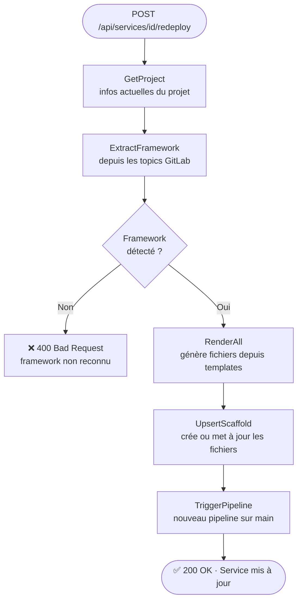

## Quand redéployer ?

Le redéploiement est utile pour :

- Forcer un nouveau pipeline sans pousser de code
- Re-synchroniser les fichiers de scaffold après une mise à jour des templates CNP
- Récupérer d'un pipeline cassé

---

## Depuis le dashboard

1. Trouvez le service dans la liste
2. Cliquez sur **Redéployer**
3. CNP exécute dans l'ordre :
   - Re-scaffold (génère et pousse les fichiers CI/CD)
   - Déclenche un pipeline GitLab sur la branche par défaut

---

## Ce que fait le redéploiement

<Warning>
  Le framework est détecté automatiquement depuis les topics GitLab. Si aucun topic `go`/`nextjs`/`springboot` n'est trouvé, le redéploiement échoue avec `400 Bad Request`.
</Warning>

---

## Gestion des erreurs

| Code | Message | Cause |
| --- | --- | --- |
| `400` | `id invalide` | L'ID dans l'URL n'est pas un entier valide |
| `400` | `framework non reconnu` | Aucun topic de framework sur le projet |
| `403` | `Token GitLab non configuré` | PAT absent |
| `502` | `impossible de joindre GitLab` | GitLab inaccessible |

---

## Note sur l'échec de pipeline

Si le déclenchement du pipeline échoue, le redéploiement réussit quand même (`200 OK`). L'erreur est loggée en `WARN`. Vous pouvez déclencher manuellement le pipeline depuis GitLab.