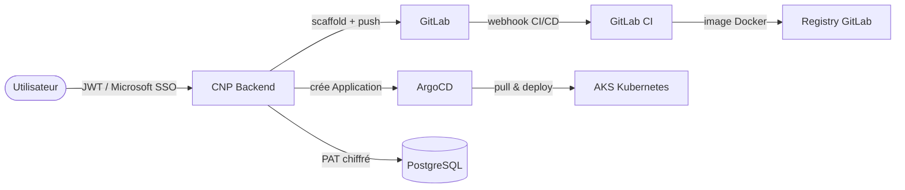

# Cloud Native Platform

CNP est la plateforme développée par l'équipe **2Morgan** pour automatiser l'intégralité du cycle de vie d'un service cloud-native — de la création du dépôt GitLab jusqu'au déploiement continu sur Kubernetes (AKS) via ArgoCD.

## Ce que fait CNP

<CardGroup cols={2}>
  <Card title="Scaffolding automatique" icon="wand-magic-sparkles">
    Génère la structure complète d'un projet (Dockerfile, CI/CD, manifests K8s) pour **5 frameworks** : Go, Next.js, NestJS, Spring Boot, Django.
  </Card>

  <Card title="CI/CD GitLab intégré" icon="gitlab">
    Pousse directement un `.gitlab-ci.yml` optimisé dans votre dépôt — build, test et publication d'image Docker inclus.
  </Card>

  <Card title="Déploiement ArgoCD" icon="rocket">
    À la fin du scaffold, CNP crée automatiquement une **Application ArgoCD** sur votre cluster AKS et déclenche le premier déploiement.
  </Card>

  <Card title="Authentification SSO" icon="shield-check">
    Connexion par identifiants admin **ou** via **Microsoft Entra ID** (Azure AD) avec validation JWKS RSA — pour les équipes EPITA.
  </Card>
</CardGroup>

## Architecture en bref

## Démarrage rapide

<Steps>
  <Step title="Enregistrer votre PAT GitLab">
    Créez un Personal Access Token GitLab avec les scopes `api` \+ `write_repository` et enregistrez-le via `POST /api/pat`.
  </Step>
  <Step title="Configurer un service">
    Appelez `POST /api/services` avec le path GitLab, le namespace K8s et le nom du service. CNP détecte automatiquement le framework et génère tous les fichiers.
  </Step>
  <Step title="Déploiement automatique">
    ArgoCD prend le relais : il synchronise les manifests K8s depuis GitLab et déploie votre service sur AKS. L'IP de l'Ingress est retournée dans la réponse.
  </Step>
</Steps>

## Frameworks supportés

| Framework | Détection automatique | CI/CD | K8s manifests |
| --- | --- | --- | --- |
| **Go** | `go.mod` | ✅ | ✅ |
| **Next.js** | `package.json` \+ next | ✅ | ✅ |
| **NestJS** | `package.json` \+ @nestjs | ✅ | ✅ |
| **Spring Boot** | `pom.xml` | ✅ | ✅ |
| **Django** | `manage.py` | ✅ | ✅ |

## Navigation

<CardGroup cols={2}>
  <Card title="Quickstart" icon="play" href="/quickstart">
    Lancez votre premier service en moins de 5 minutes.
  </Card>

  <Card title="Architecture" icon="diagram-project" href="/architecture">
    Vue d'ensemble des composants et flux de données.
  </Card>

  <Card title="Guides" icon="book-open" href="/guides/pat-setup">
    Tutoriels pas à pas pour chaque fonctionnalité.
  </Card>

  <Card title="API Reference" icon="code" href="/api-reference/authentication">
    Documentation complète de tous les endpoints REST.
  </Card>
</CardGroup>